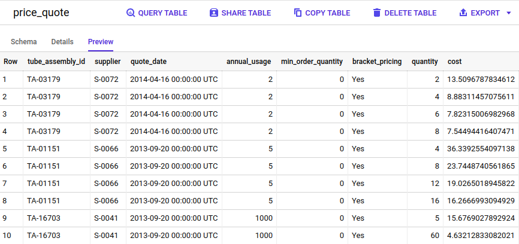
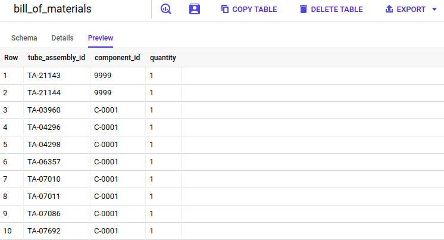
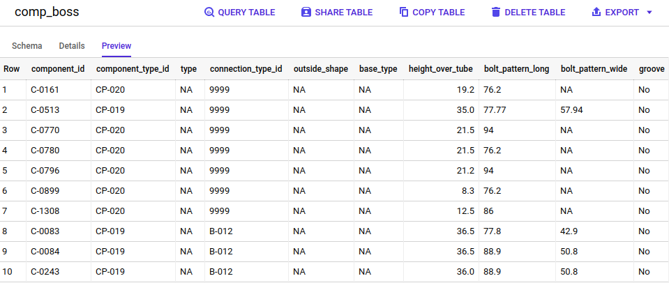

### Modelagem dos dados

Mantive as tabelas `price_quote` e `comp_boss` iguais a estrutura do respectivo arquivo csv, e alterei
a tabela `bill_of_materials` para ter apenas 3 campos, já que os campos component_id_1, quantity_1,component_id_2, quantity_2, etc. se repetem e mudam apenas o sufixo final.

#### Tabela price_quote
- tube_assembly_id
- supplier
- quote_date
- annual_usage
- min_order_quantity
- bracket_pricing
- quantity	
- cost



#### Tabela bill_of_materials
- tube_assembly_id	
- component_id	
- quantity



#### Tabela comp_boss
- component_id
- component_type_id	
- type	
- connection_type_id	
- outside_shape	
- base_type	
- height_over_tube	
- bolt_pattern_long	
- bolt_pattern_wide	
- groove	
- base_diameter	
- shoulder_diameter	
- unique_feature	
- orientation	
- weight




### Aplicação

É uma aplicação simples que recebe alguns argumentos para execução, usa o Apache Spark para ler os arquivos no formato csv, 
e grava cada arquivo em uma tabela correspondente no BigQuery usando a lib [spark-bigquery-connector] (https://github.com/GoogleCloudDataproc/spark-bigquery-connector)


Parâmetros:

| Parâmetro              | parâmetro reduzido  | Valor padrão  | Descrição                                                    |
|------------------------|:-------------------:|---------------|--------------------------------------------------------------|
| `app-name`             | `app`               | bvs-test-job  | Nome do job                                                  |
| `gcs-input-bucket`     | `gib`               |               | **Obrigatório** Bucket contendo os arquivos csv de entrada   |
| `gcs-temp-bucket`      | `gtb`               |               | **Obrigatório** Bucket temporário                            |
| `bq-dataset`           | `bds`               |               | **Obrigatório** Dataset do BigQuery                          |
| `bq-save-mode`         | `bsm`               | Append        | Save mode para as tabelas no BigQuery [Overwrite, Append]    |


#### Pre-requisito
- JDK 1.8
- Scala 2.12.12
- SBT 1.4.7

#### Build da aplicação
 ```shell script
sbt clean package
 ```

### Execução no GCP

Executar scripts abaixo:

#### Variáveis de ambiente
```shell script
export BUCKET_NAME=bvs-test-bucket
export PROJECT=bvs-test-project
export CLUSTER=bvs-test-cluster
```

#### Login no GCP
```shell script
gcloud auth login
```

#### Criação do bucket do GCS aonde serão gravados os arquivos csv
```shell script
gsutil mb -c regional -l us-central1 gs://$BUCKET_NAME
```

#### Criação do dataset do BigQuery aonde serão salvas as tabelas 
```shell script
bq --location=US mk -d \
    --default_table_expiration 3600 \
    --description "BVS dataset." \
    ${PROJECT}:bvs-dataset
```

#### Criação do cluster do Dataproc aonde o job será executado
```shell script
gcloud beta dataproc clusters create ${CLUSTER}  \
    --bucket ${BUCKET_NAME} --region us-central1 --zone us-central1-a \
    --single-node --master-machine-type n1-standard-2 --master-boot-disk-size 20 \
    --image-version 1.5-debian10 --project $PROJECT
```
     
#### Copiar arquivos csv para o bucket do GCS
 ```shell script
gsutil cp data/*.csv gs://${BUCKET_NAME}/input/
 ```

#### Copiar job para o bucket do GCS
```shell script
gsutil cp /home/anderson.souza/personal/projects/bvs-test/target/scala-2.12/bvs-test_2.12-0.0.1.jar \
    gs://${BUCKET_NAME}/job/bvs-test_2.12-0.0.1.jar
```

#### Submeter job para ser processado no cluster do Dataproc
```shell script
gcloud dataproc jobs submit spark \
    --properties='spark.executor.memory=2G' \
    --cluster=${CLUSTER} \
    --region=us-central1 \
    --class=br.com.bvs.data.IngestionMain \
    --jars=gs://${BUCKET_NAME}/job/bvs-test_2.12-0.0.1.jar,gs://spark-lib/bigquery/spark-bigquery-latest_2.12.jar \
    -- -gib gs://${BUCKET_NAME}/input -gtb bvs-test-tmp -bds bvsdataset -bsm overwrite
```

#### Não esqueça de parar e remover o cluster do Dataproc após a execução
```shell script
gcloud beta dataproc clusters stop ${CLUSTER} \
    --region=us-central1
gcloud dataproc clusters delete ${CLUSTER} \
    --region=us-central1
```

### Melhorias
- Descobrir frequência e volume de dados por dia/semana/mês
- Testar performance baseado nessa frequência/volume para identificar melhorias no cluster, configurações de recursos do job e modelagem dos dados
- Automatizar execução usando alguma ferramenta do tipo Airflow
- Escrever mais unit tests e testes de integração
- Automatizar execução de tasks, exemplo build, criação de buckets, criação de cluster usando Makefile
- Visualizar os dados no DataStudio